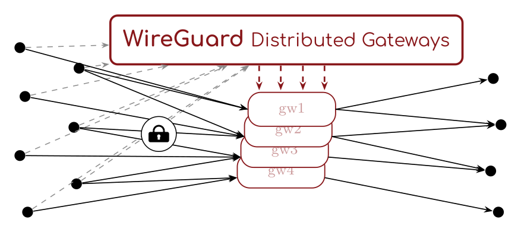

# WDG — WireGuard Distributed Gateways

<p align="center">
  
</p>

> ⚠️ **Work in Progress** — Projet en développement actif (assisté IA). L'architecture est stable et une preuve de concept de bout en bout tourne et est testée sous Docker ; **pas prêt pour la production**.

*Read in [English](README.md).*

WDG est un VPN d'entreprise basé sur [WireGuard](https://www.wireguard.com/), conçu pour remplacer des déploiements L2TP/IPsec et WebVPN. Un **plan de contrôle** Django centralisé authentifie les utilisateurs via le SSO (Apereo CAS), provisionne dynamiquement les configurations WireGuard par utilisateur, et distribue les accès réseau sur plusieurs **passerelles** selon l'appartenance aux groupes. La PSK est livrée sur un canal TLS **post-quantique** tout en conservant des **clients WireGuard standards** sur tous les OS.

---

## Contexte

L'objectif est une alternative zero-trust aux VPN à tunnel (L2TP, VPN classique), sans dépendre de solutions propriétaires — ou « open-source » au licensing incertain. Le design reste volontairement simple pour réduire le coût de maintenance (surtout côté client) et garder le contrôle en interne.

Côté client, on utilise des **clients WireGuard standards** ; WDG ne génère que le `.conf`.

---

## Architecture

```
   client (multi-OS, WireGuard standard)
     │  navigateur ─► control-plane /auth/cas ─► cas.example.org (ticket CASv3)
     │  HTTPS sur TLS post-quantique (X25519MLKEM768) + token WDG
     ▼
  nginx-pq  ─►  control-plane (Django + PostgreSQL)
                 ├─ /auth/cas/{login,callback}   valide le ticket, émet le token WDG
                 ├─ /api/peers/register/          enregistre la clé publique du device
                 ├─ /api/config/                  génère le .conf (PSK + AllowedIPs par groupe)
                 └─ /api/gateways/sync/           les passerelles tirent leurs peers autorisés
                                  │
                        ┌─────────┴─────────┐
                    gateway-A            gateway-B     (agent Python + WireGuard noyau)
                    entrée               entrée
                    réseaux X,Y          réseaux Z
```

- **Authentification** : CASv3 (protocole natif à tickets) contre votre serveur Apereo CAS ; le plan de contrôle valide le ticket côté serveur et émet son propre token de session signé. Voir [pourquoi CASv3 et pas OIDC](docs/DEPLOYMENT.md#authentication-casv3).
- **Autorisation** dans WDG : un *groupe* accorde des *passerelles* d'entrée et des *réseaux* de sortie ; l'accès effectif est l'union sur les groupes de l'utilisateur. L'appartenance est reflétée depuis les attributs CAS (`memberOf`, affiliations) avec repli sur l'affectation manuelle en admin. Voir [docs/GROUPS.md](docs/GROUPS.md).
- **Post-quantique** : la livraison de la PSK passe par TLS 1.3 avec le groupe hybride `X25519MLKEM768`, neutralisant le « harvest-now-decrypt-later ». La compatibilité est préservée par défaut ; le PQ peut être rendu obligatoire via un interrupteur serveur. Voir [docs/POST-QUANTUM.md](docs/POST-QUANTUM.md).

### Composants

- **Plan de contrôle** (`server/`, Django + PostgreSQL) — auth CAS, modèle groupes/passerelles/réseaux + admin, API de provisioning et de sync, génération de conf.
- **Agent passerelle** (`gateway/`, Python) — monte WireGuard noyau, réconcilie les peers depuis l'API de sync toutes les quelques secondes, programme routage/NAT et filtrage de sortie par peer.
- **Terminaison PQ** (`deploy/nginx-pq/`) — nginx (OpenSSL ≥ 3.5) terminant le HTTPS client avec le groupe hybride et un interrupteur fail-closed optionnel.
- **Client** (`wg_client/`, Python/Click) — CLI multi-OS : login SSO, génération de clés, récupération de conf, gestion du tunnel `wg-quick`/WireGuard, bilingue (EN/FR).

---

## État

Une preuve de concept de bout en bout est implémentée et **testée sous Docker** (chemin de données Linux exercé pour de vrai) :

- [x] Plan de contrôle — modèles (Users, Groups, Devices, Gateways, Networks) + admin
- [x] Authentification CASv3 + tokens de session WDG
- [x] API de provisioning (`register`, `config`) avec PSK par device
- [x] API de sync + agent passerelle (WireGuard noyau, tunnel réel)
- [x] Routage entrée/sortie piloté par groupe + firewall de sortie par peer
- [x] Révocation à la désactivation d'un compte/device
- [x] Transport TLS post-quantique (`X25519MLKEM768`) + interrupteur client `require_pq`
- [x] Mapping attribut CAS → groupe (+ résilience si attributs non libérés)
- [x] Plan de contrôle multi-tunnel — sites, services (réservoirs de passerelles), graphe de relais, `/api/plan/` ([design](docs/DESIGN-MULTITUNNEL.md))
- [x] Passerelles relais — liens WireGuard inter-passerelles, contrôle d'egress à chaque saut, sortie en chaîne (testé : chaîne réelle wdgw-a → relay-dc)
- [x] Client multi-tunnel — tunnels simultanés depuis `/api/plan/`, bascule à la connexion entre instances d'un service (testé : instance morte et instance muette)
- [x] Client Python (Linux) — testé de bout en bout
- [x] Interface graphique + zone de notification (Qt/PySide6, même couche d'opérations que la CLI) et binaires tout-en-un — `make build-clients` (binaires Linux + .exe Windows avec le MSI WireGuard officiel embarqué, installé au premier lancement)
- [ ] Client Python (macOS / Windows) — code présent et testé unitairement, **recette sur machines réelles à faire** ([checklist](docs/VALIDATION-CLIENTS.md))
- [ ] Portail web d'enrôlement *(nice-to-have)*
- [ ] Durcissement production (secrets, certificats TLS, HA, clés passerelle persistantes)

---

## Démarrage rapide (stack de dev)

Prérequis : Docker + Docker Compose, et un hôte Linux dont le noyau fournit WireGuard (standard depuis 5.6). La stack utilise un **mock CAS**, aucun vrai SSO n'est nécessaire.

```bash
cd deploy
docker compose up -d --build          # postgres, mock CAS, control-plane ×5 (2 ext + 2 int + admin), nginx-pq
docker compose exec control-plane-admin python manage.py seed_demo
docker compose exec control-plane-admin python manage.py createsuperuser  # optionnel (admin)
```

Lancer les tests :

```bash
# Tests unitaires Django (modèle, résolveur, provisioning, mapping CAS)
docker compose exec -e WDG_PLANES=external,internal,admin control-plane-admin python manage.py test

# Intégration de bout en bout (login CASv3, provisioning, conf, groupes CAS)
docker compose run --rm tester

# Tunnels WireGuard réels : plan multi-tunnel, egress par groupe, chaîne de relais
docker compose --profile tunnel up -d --build \
  wdgw-a wdgw-a2 wdgw-b relay-dc exit-target exit-target-b exit-target-dc exit-target-lab-b
docker compose --profile tunnel run --rm -e USERNAME=alice \
  -e "REACH=http://10.0.0.10:8000,http://192.168.20.10:8000,http://192.168.30.10:8000,http://192.168.40.10:8000" \
  client-probe

# Bascule : on arrête l'instance préférée, le client se replie sur wdgw-a2
docker compose stop wdgw-a
docker compose --profile tunnel run --rm -e USERNAME=alice \
  -e "REACH=http://192.168.40.10:8000" -e "EXPECT_VIA=wdg-a=wdgw-a2" client-probe
docker compose start wdgw-a

# Bascules HA (arrête/redémarre des instances du plan de contrôle, depuis la racine)
make -C .. e2e-ha

# Transport post-quantique (depuis un hôte avec OpenSSL >= 3.5)
bash tests/m5_pq_check.sh
```

Voir [docs/DEPLOYMENT.md](docs/DEPLOYMENT.md) pour l'ensemble et la marche vers la production.

---

## Utilisation du client

```bash
pipx install .           # fournit l'exécutable `wg-client` (ou : pip install .)
# alternative dev : pip install -r wg_client/requirements.txt + python -m wg_client.main

wg-client configure --server https://vpn.example.com
wg-client login          # SSO, affiche identité + groupes
wg-client connect        # provisionne + monte tous les tunnels du plan
wg-client status         # une ligne par tunnel (service, instance, handshake)
wg-client reconnect      # plan frais : démonte puis remonte tout
wg-client disconnect

# Exiger le TLS post-quantique (échoue si indisponible) :
wg-client configure --server https://vpn.example.com --require-pq
```

Interface en français : `WDG_LANG=fr wg-client --help`. La négociation post-quantique nécessite un OpenSSL ≥ 3.5 côté client — voir [docs/POST-QUANTUM.md](docs/POST-QUANTUM.md#client-side).

---

## Documentation

- [docs/DEPLOYMENT.md](docs/DEPLOYMENT.md) — déploiement du plan de contrôle et des passerelles, enregistrement CAS, notes production
- [docs/GROUPS.md](docs/GROUPS.md) — le modèle de groupes et la dérivation du routage entrée/sortie
- [docs/GUIDE-UTILISATEUR.md](docs/GUIDE-UTILISATEUR.md) — guide utilisateur final
- [docs/VALIDATION-CLIENTS.md](docs/VALIDATION-CLIENTS.md) — checklist de recette des clients macOS/Windows
- [docs/POST-QUANTUM.md](docs/POST-QUANTUM.md) — le design post-quantique, garanties et limites

---

## Stack technique

| Composant | Technologie |
|---|---|
| Plan de contrôle | Python / Django / PostgreSQL |
| Auth SSO | Apereo CAS v3 (protocole natif à tickets) |
| VPN | WireGuard (noyau) |
| Agent passerelle | Python + `wg` + iptables |
| Transport PQ | nginx + OpenSSL ≥ 3.5 (`X25519MLKEM768`) |
| Client | Python / Click / `cryptography` / `keyring` |
| Infra dev/test | Docker Compose |

---

## Licence

Distribué sous la [GNU Affero General Public License v3.0](LICENSE). Voir le fichier `LICENSE` pour les termes complets.
