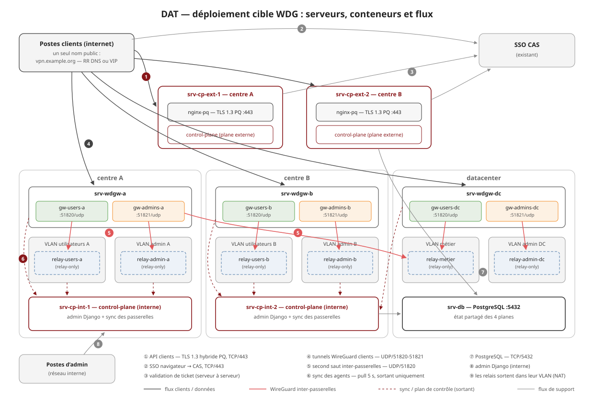

# DAT — Document d'architecture technique WDG

Architecture cible de déploiement : quels serveurs, quels conteneurs sur
chacun, et quels flux entre eux. Tout composant est livré comme **image
Docker** (`control-plane`, `gateway`, `nginx-pq` — voir
[DEPLOYMENT.md](DEPLOYMENT.md#images--registry-make-build--make-push)) ;
un serveur = un `docker compose` minimal tenu par l'outillage de conf
(Puppet).

Le schéma d'ensemble :

## 1. Principes

- **Deux planes de configuration externes** publient l'API clients
  (authentification CAS + provisioning) derrière un nom unique
  `vpn.example.org` porté en **round-robin DNS ou par la VIP existante**.
  Chaque serveur externe embarque son terminateur TLS post-quantique
  (nginx-pq) et une instance Django `WDG_PLANES=external`.
- **Deux planes internes** (même mécanisme de haute disponibilité) servent
  l'admin Django et l'API de sync des passerelles — jamais exposés à
  l'extérieur ; l'instance externe **ne route même pas** `/admin/` ni
  `/api/gateways/sync/`.
- **Une wdgw par centre et une au datacenter** : un serveur d'entrée par
  site, hébergeant deux conteneurs `gateway` — l'instance *users*
  (UDP/51820) et l'instance *admins* (UDP/51821). Les instances d'un même
  service sont interchangeables entre sites (bascule à la connexion).
- **Un relais dans chaque VLAN à joindre** : les wdgw n'ont **aucune patte
  dans les VLANs**. Chaque VLAN cible héberge un petit serveur (ou VM)
  avec un conteneur `gateway` en mode *relay-only* ; on n'atteint le VLAN
  qu'en second saut, chiffré de bout en bout entre passerelles.
- **Un PostgreSQL** partagé par les quatre instances Django : c'est lui
  qui rend le plan de contrôle sans état (jetons signés, codes à usage
  unique, enrôlements — tout est en base).
- **Les passerelles et relais ne reçoivent aucune connexion de gestion** :
  l'agent *tire* son état du plane interne toutes les 5 s (HTTPS sortant
  uniquement) et bascule seul d'un plane interne à l'autre
  (`WDG_CONTROL_PLANE=https://cp-int-1…,https://cp-int-2…`).

## 2. Inventaire des serveurs

| Serveur | Site | Conteneurs (image) | Exposition |
|---|---|---|---|
| `srv-cp-ext-1` | centre A | `nginx-pq` (443) + `control-plane` (`WDG_PLANES=external`) | **Internet** : TCP/443 |
| `srv-cp-ext-2` | centre B | idem | **Internet** : TCP/443 |
| `srv-cp-int-1` | centre A | `control-plane` (`WDG_PLANES=internal`) | interne : passerelles/relais + admins |
| `srv-cp-int-2` | centre B | idem | interne |
| `srv-wdgw-a` | centre A | `gateway` ×2 : `gw-users-a` (UDP/51820), `gw-admins-a` (UDP/51821) | **Internet** : UDP 51820-51821 |
| `srv-wdgw-b` | centre B | `gateway` ×2 : `gw-users-b`, `gw-admins-b` | **Internet** : UDP 51820-51821 |
| `srv-wdgw-dc` | datacenter | `gateway` ×2 : `gw-users-dc`, `gw-admins-dc` | **Internet** : UDP 51820-51821 |
| `srv-relay-<vlan>` | dans chaque VLAN cible | `gateway` ×1 (service *relay-only*, UDP/51820) | interne : UDP depuis les wdgw |
| `srv-db` | datacenter | `postgres:16` | interne : TCP/5432 depuis les 4 planes |

Relais types du périmètre actuel : `relay-metier` (VLAN métier),
`relay-users-a`/`-b` (VLANs utilisateurs), `relay-admin-a`/`-b`/`-dc`
(VLANs d'administration). Ajouter un VLAN au périmètre = poser un relais
dedans et le déclarer dans l'admin — **aucune modification des wdgw**.

Le placement (ext-1/int-1 au centre A, ext-2/int-2 au centre B, BDD au
datacenter) répartit la perte d'un site : il reste toujours un plane de
chaque type. La BDD est le seul composant singulier — voir §5.

## 3. Adressage et noms

| Nom | Porté par | Mécanisme |
|---|---|---|
| `vpn.example.org` (443) | srv-cp-ext-1 + srv-cp-ext-2 | RR DNS **ou** VIP existante |
| `gw-users-{a,b,dc}.vpn.example.org` (51820/udp), `gw-admins-…` (51821/udp) | chaque wdgw | A direct par site (la bascule entre sites est portée par le *plan*, pas par le DNS) |
| `cp-int-1/2.example.internal` (443 ou 8000) | planes internes | les agents portent les **deux** URLs ; une VIP interne convient aussi |
| `db.example.internal` (5432) | srv-db | — |

Chaque passerelle/relais a un `tunnel_subnet` dédié (disjoint dans la
flotte, contrôlé par le modèle) ; les adresses clients y sont allouées en
`/32`. Le trafic relayé n'est **pas** NATé entre passerelles : l'adresse
tunnel du poste reste visible jusqu'au relais (traçabilité + pare-feu par
poste à chaque saut), le NAT de sortie n'a lieu que sur la patte finale.

## 4. Matrice des flux

Les numéros renvoient au schéma.

| # | Source | Destination | Proto/port | Rôle |
|---|---|---|---|---|
| ① | postes clients (internet) | `vpn.example.org` → srv-cp-ext-* | TCP/443 — TLS 1.3 hybride PQ (`X25519MLKEM768`) | auth CAS, enrôlement, plan de tunnels |
| ② | navigateur des postes | CAS (SSO existant) | TCP/443 | login SSO (redirection) |
| ③ | srv-cp-ext-* | CAS | TCP/443 | validation de ticket serveur-à-serveur |
| ④ | postes clients | wdgw (par site) | UDP/51820 (users), UDP/51821 (admins) | tunnels WireGuard clients |
| ⑤ | wdgw-* | relais des VLANs accordés | UDP/51820 | tunnels WireGuard inter-passerelles (second saut) |
| ⑥ | wdgw-* et relais-* | cp-int-1 **et** cp-int-2 | TCP/443 (ou 8000) | sync de l'agent, pull toutes les 5 s |
| ⑦ | srv-cp-ext-*, srv-cp-int-* | srv-db | TCP/5432 | PostgreSQL |
| ⑧ | postes d'admin (interne) | cp-int-* | TCP/443 (ou 8000) | admin Django |
| ⑨ | relais-`<vlan>` | son VLAN | selon les applications | sortie finale (NAT du relais) |

À noter, côté filtrage :

- **aucun flux entrant** sur les relais depuis leur VLAN (⑨ est sortant),
  ni sur les wdgw autre que du WireGuard ;
- **le plan de contrôle n'initie jamais rien** vers les passerelles : ⑥
  est purement sortant depuis les wdgw/relais — pas de port de gestion
  ouvert sur les équipements d'entrée ;
- les planes internes n'ont **pas** besoin d'être joignables des postes
  clients, seulement des passerelles, relais et postes d'admin.

## 5. Haute disponibilité et modes dégradés

| Composant | Mécanisme | Panne → effet |
|---|---|---|
| Entrée clients (wdgw) | instances interchangeables par service, site préféré d'abord ; bascule à la connexion (poignée de main ≤ 12 s par instance) | perte d'un site : les clients entrent par un autre ; seuls les VLANs du site perdu deviennent injoignables |
| Planes externes | RR DNS / VIP, instances sans état (codes + jetons en BDD partagée) | perte d'une instance : transparent (validé en maquette) |
| Planes internes | double URL dans chaque agent, bascule au cycle suivant (≤ 5 s) ; l'admin vise l'un ou l'autre | perte d'une instance : transparent pour la flotte (validé en maquette) |
| PostgreSQL | instance unique + sauvegardes ; réplication streaming ou service managé recommandé en production | **les tunnels établis continuent** (les agents gardent leur dernier état appliqué et ne détruisent rien quand la sync échoue) ; gel des enrôlements, des nouvelles connexions et des changements de droits jusqu'au retour |
| nginx-pq | un par serveur externe (pas de paire active/passive à gérer) | suit la disponibilité de son serveur |

## 6. Déploiement par serveur (images Docker)

Toutes les images sont poussées taguées SHA + `latest`
(`make push REGISTRY=…`) ; chaque serveur tire son couple image/tag.

- **srv-cp-ext-N** — `nginx-pq` (`UPSTREAM=127.0.0.1:8000`, `REQUIRE_PQ`
  au choix, vrais certificats) + `control-plane` avec
  `WDG_PLANES=external`, `WDG_MIGRATE=0`, `WDG_SECRET_KEY` (identique sur
  les 4 planes), `POSTGRES_*`, `WDG_CAS_BASE_URL`, `WDG_PUBLIC_BASE_URL=https://vpn.example.org`.
- **srv-cp-int-N** — `control-plane` avec `WDG_PLANES=internal` ; les
  migrations sont appliquées par **une seule** instance
  (`WDG_MIGRATE=1` sur int-1, `0` partout ailleurs) ou par un job dédié
  au déploiement.
- **srv-wdgw-X** — deux conteneurs `gateway` (users/admins), chacun :
  `NET_ADMIN`, `net.ipv4.ip_forward=1`, volume d'état (identité WireGuard
  persistante), `WDG_GATEWAY_TOKEN` propre, et
  `WDG_CONTROL_PLANE=https://cp-int-1…,https://cp-int-2…`. Le port
  d'écoute (51820/51821) vient du champ `listen_port` de la passerelle
  dans l'admin — c'est ce qui permet la cohabitation sur un serveur.
- **srv-relay-\<vlan\>** — un conteneur `gateway` identique (seul le token
  change) ; le serveur a une patte dans le VLAN cible.
- **srv-db** — `postgres:16` + volume + sauvegardes.

La maquette `deploy/docker-compose.yml` reproduit ce découpage à
l'échelle d'une machine : 2 planes externes derrière l'alias `cp-ext`
(round-robin DNS Docker, tenant lieu de RR/VIP), 2 planes internes
`cp-int`, un service `migrate` one-shot, PostgreSQL, et les passerelles
pointant sur les deux URLs internes.

## 7. Validé en maquette / reste à faire

Validé (stack compose, juillet 2026) : split externes/internes en 2×2,
RR sur l'alias externe, bascule d'agent int-1→int-2 en ≤ 5 s, parcours
client complet (enrôlement + 2 tunnels + trafic + relais) avec la moitié
du cluster arrêtée, migrations à instance unique, gunicorn + statics
admin.

Reste pour la production : certificats réels (interne CA/ACME) et vrais
secrets, réplication/sauvegarde PostgreSQL, supervision (le `/healthz`
existe sur chaque plane ; l'état de sync des passerelles se lit en BDD),
empaquetage du client (script console installable), validation
macOS/Windows sur postes réels.
