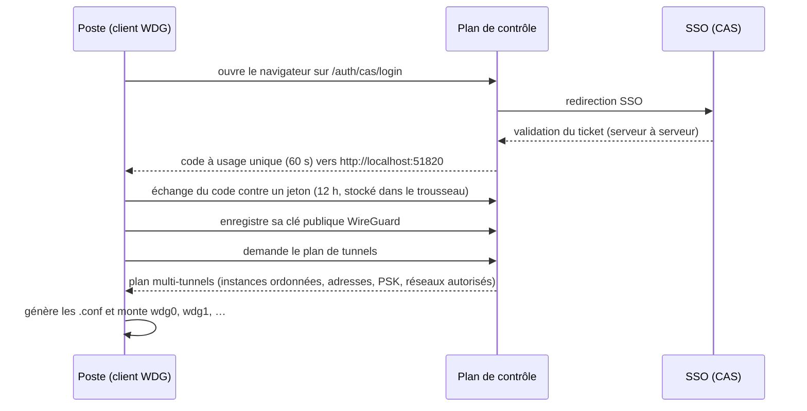

# Parcours utilisateur — du poste vierge au retrait des droits

Ce document déroule pas à pas ce qui se passe réellement, côté poste de
travail comme côté passerelles, dans l'architecture cible décrite dans
[SCENARIOS.md](SCENARIOS.md). Tout ce qui suit correspond au comportement
du PoC actuel (client `wg_client/`, plan de contrôle `server/`, agent de
passerelle `gateway/`).

## 1. Installation : deux briques sur le poste

**WireGuard standard.** C'est le moteur des tunnels : le module noyau sous
Linux, l'application officielle sous Windows/macOS. On ne le modifie pas,
on ne le patche pas — c'est le WireGuard du commerce, et c'est voulu : le
chiffrement et le tunnel restent un composant standard, audité, maintenu
en dehors de nous.

**Le client WDG** (`wg-client`, une CLI Python). Il ne remplace pas
WireGuard, il le pilote. Son rôle : l'authentification SSO, la gestion des
clés, la récupération du *plan* de tunnels, puis le montage de **plusieurs
tunnels simultanés** (`wdg0`, `wdg1`, …) via l'outillage standard
(`wg-quick` sous Linux/macOS, `wireguard.exe` sous Windows — où il active
au passage le réglage `MultipleSimultaneousTunnels`).

L'installation se résume à installer WireGuard, poser le client, et le
pointer sur le plan de contrôle :

```sh
wg-client configure --server https://vpn.example.org   # + --require-pq si exigé
```

*(État actuel : le client est livré en module Python — `python -m
wg_client.main <commande>` ; le paquet installable fournissant l'exécutable
`wg-client` arrive avec le chantier « clients réels ». Les commandes de ce
document sont écrites avec le nom cible.)*

## 2. Première connexion : enrôlement et récupération de la configuration

Tout tient dans une commande : `wg-client connect`. Voici ce qu'elle fait.



**L'authentification** passe par le SSO existant : le client ouvre le
navigateur sur le plan de contrôle, qui redirige vers CAS. Une fois le
ticket validé (côté serveur, jamais côté client), le plan de contrôle
récupère l'identité **et les groupes** de la personne, puis renvoie au
client un code à usage unique (valable 60 secondes) via une page locale.
Le client l'échange contre un jeton valable 12 heures, rangé dans le
trousseau de l'OS. L'utilisateur ne voit qu'une chose : son navigateur
s'ouvre, il se connecte comme d'habitude, c'est fini.

**Les clés.** À la première connexion, le client génère la paire de clés
WireGuard **localement**. La clé privée ne quitte jamais le poste (elle
vit dans le trousseau) ; seule la clé publique est envoyée au serveur. Le
plan de contrôle est donc incapable d'usurper un poste — il ne détient
aucun secret client.

**L'enregistrement.** Le serveur enregistre cette clé publique sur chaque
passerelle que les groupes de l'utilisateur l'autorisent à utiliser, et
attribue pour chacune une **adresse IP dédiée** dans le subnet de tunnel
de la passerelle, plus une **clé partagée (PSK)** propre au couple
poste↔passerelle. Ces valeurs sont stables : se réenregistrer ne change
rien.

**Le plan de tunnels.** Le client reçoit ensuite un plan : **un tunnel par
service accordé** (ex. l'admin reçoit un tunnel `wdg-admins`), et pour
chaque tunnel la **liste ordonnée des instances** — la passerelle du
centre de rattachement de l'utilisateur d'abord, les autres ensuite. À
partir de ce plan, le client fabrique un fichier WireGuard tout à fait
ordinaire par tunnel :

```ini
[Interface]
PrivateKey = (générée localement, jamais transmise)
Address    = 10.10.11.7/32          # l'adresse attribuée sur cette passerelle

[Peer]
PublicKey           = (celle de la passerelle)
PresharedKey        = (fournie par le plan)
Endpoint            = gw-admins-a.vpn.example.org:51820
AllowedIPs          = 10.30.0.0/23, 10.40.10.0/24, 10.40.20.0/24, 10.40.40.0/24
PersistentKeepalive = 25
```

Le point important est `AllowedIPs` : il contient **exactement les réseaux
que les groupes de l'utilisateur autorisent** — ni plus, ni moins. Pas de
subnets techniques, pas de réseaux « au cas où » : c'est ce champ qui fait
que le poste route vers le tunnel le trafic destiné aux réseaux accordés,
et rien d'autre. Quand plusieurs tunnels sont montés, les réseaux sont
répartis entre eux sans recouvrement ; un service « route par défaut »
(type VPN classique) recevrait `0.0.0.0/0`.

**Protection post-quantique.** Ce plan transporte les PSK : le canal HTTPS
qui le livre est protégé par TLS hybride post-quantique
(`X25519MLKEM768`) au niveau du reverse proxy. Le client vérifie après
coup quel groupe cryptographique a réellement été négocié, et en mode
`--require-pq` il refuse de continuer si l'échange n'était pas
post-quantique — le serveur peut aussi l'imposer de son côté.

## 3. Connexion et rebonds : ce qui se passe de bout en bout

**Côté poste : bascule à la connexion.** Pour chaque tunnel du plan, le
client tente les instances **dans l'ordre** : il monte le tunnel vers la
passerelle de son centre et attend une poignée de main WireGuard (12
secondes maximum). Pas de réponse — centre en panne, coupure réseau ? Il
démonte et passe à l'instance suivante : c'est le failover par centre,
sans configuration ni action de l'utilisateur.

**Côté passerelle d'entrée.** Chaque passerelle exécute un agent qui
interroge le plan de contrôle **toutes les 5 secondes** et applique ce
qu'il reçoit :

- les pairs WireGuard (une entrée par poste autorisé, verrouillée sur son
  adresse `/32`) ;
- un **pare-feu par défaut fermé** : une chaîne dédiée n'accepte que les
  couples « ce poste → ce réseau » correspondant aux droits du moment, et
  jette tout le reste. Monter le tunnel ne suffit donc pas : chaque
  destination est contrôlée individuellement, à chaque paquet ;
- le NAT de sortie vers les réseaux raccordés en direct.

La passerelle ne décide rien : elle applique l'état que le plan de
contrôle lui décrit, et retire d'elle-même tout pair qui n'y figure plus.

**Le rebond via relais.** Suivons un admin, entré par la passerelle admin
du centre A, qui ouvre une session sur une machine du VLAN admin du
datacenter :

1. Sur le poste, `AllowedIPs` contient le VLAN admin du datacenter : le
   paquet part dans le tunnel `wdg-admins`, chiffré jusqu'à la passerelle
   d'entrée du centre A.
2. La passerelle vérifie le couple « ce poste → ce réseau » dans son
   pare-feu. Autorisé (groupe `admins`). Sa table de routage envoie le
   paquet vers le **relais du datacenter** — qui est simplement un autre
   pair WireGuard de la passerelle, sur la même interface : les
   passerelles et relais entretiennent entre eux des tunnels permanents.
   Le paquet repart donc chiffré, et l'adresse du poste est conservée
   (pas de NAT entre passerelles).
3. Le relais du datacenter reçoit le paquet, le fait sortir sur sa patte
   locale vers le VLAN admin (avec NAT de sortie, comme n'importe quelle
   passerelle).
4. Au retour, le relais sait rejoindre le poste : les subnets de tunnel
   des clients sont routés en sens inverse à travers le même tunnel
   inter-passerelles. La réponse refait le chemin en sens inverse.

Deux propriétés en découlent. D'abord, **aucun tunnel client ne se termine
sur un relais** : un service *relay-only* n'accepte pas de poste, on ne
l'atteint qu'en second saut — le VLAN admin n'est jamais exposé à
l'extérieur, même pour les ayants droit. Ensuite, le rebond est **un
privilège contrôlé** : le plan de contrôle ne route un utilisateur à
travers un relais que si ses groupes lui accordent à la fois le service
relais et le réseau de destination.

## 4. Un groupe d'accès est ajouté à l'utilisateur

Exemple : l'utilisateur intègre une équipe et son groupe lui ouvre un
nouveau réseau.

- **Côté plan de contrôle**, le changement arrive soit du SSO (les groupes
  CAS font foi et sont resynchronisés à chaque login), soit d'une
  modification directe dans l'admin.
- **Côté passerelles**, c'est automatique : au sondage suivant (au plus
  5 secondes), les règles « ce poste → ce nouveau réseau » apparaissent
  dans le pare-feu des passerelles concernées.
- **Côté poste**, il faut rafraîchir le plan : les `AllowedIPs` d'un
  tunnel monté sont figés. Un `wg-client reconnect` récupère un plan
  frais et remonte les tunnels. Deux cas de figure :
  - le nouveau réseau est derrière un service déjà accordé → seul
    `AllowedIPs` change, le poste route simplement une destination de
    plus ;
  - c'est un **nouveau service** → un tunnel supplémentaire (`wdgN`)
    apparaît, et l'enregistrement sur les nouvelles passerelles se fait
    tout seul pendant le `reconnect`.

Aucune intervention réseau, aucun câblage, aucun compte à créer sur un
équipement : l'ouverture d'un accès est une opération de groupe dans le
plan de contrôle.

## 5. Un groupe est retiré à l'utilisateur

C'est le miroir du cas précédent, avec une nuance importante : **la
révocation n'attend pas le poste**.

- Au sondage suivant (au plus 5 secondes), les règles « ce poste → ce
  réseau » disparaissent du pare-feu des passerelles. Comme celui-ci est
  par défaut fermé, le trafic vers le réseau retiré est **jeté
  immédiatement, y compris sur un tunnel déjà établi** : la session en
  cours vers ce réseau meurt, sans que le tunnel lui-même soit coupé si
  d'autres droits subsistent.
- Le poste, lui, garde des routes périmées jusqu'à son prochain
  `reconnect` — sans conséquence : les paquets partent dans le tunnel et
  sont refusés à l'entrée.
- Pour une révocation totale (départ, poste compromis), on désactive
  l'utilisateur ou l'appareil dans le plan de contrôle : au sondage
  suivant, le pair est **retiré des passerelles** (le tunnel tombe), et le
  jeton du client cesse d'être accepté — un jeton n'est valable que pour
  un compte actif, et expire de toute façon au bout de 12 heures.

## Les constantes de temps à retenir

| Événement | Délai | D'où ça vient |
|---|---|---|
| Prise en compte d'un droit ajouté/retiré sur les passerelles | ≤ 5 s | intervalle de sondage de l'agent |
| Bascule sur le centre suivant à la connexion | ≤ 12 s par instance | attente de poignée de main WireGuard |
| Nouveau réseau visible depuis le poste | au `reconnect` | les `AllowedIPs` sont figés au montage |
| Code de connexion SSO | 60 s, usage unique | échange code → jeton |
| Jeton client | 12 h, invalidé si compte désactivé | jeton signé, vérifié à chaque appel |
| Keepalive des tunnels (client et inter-passerelles) | 25 s | `PersistentKeepalive` |
