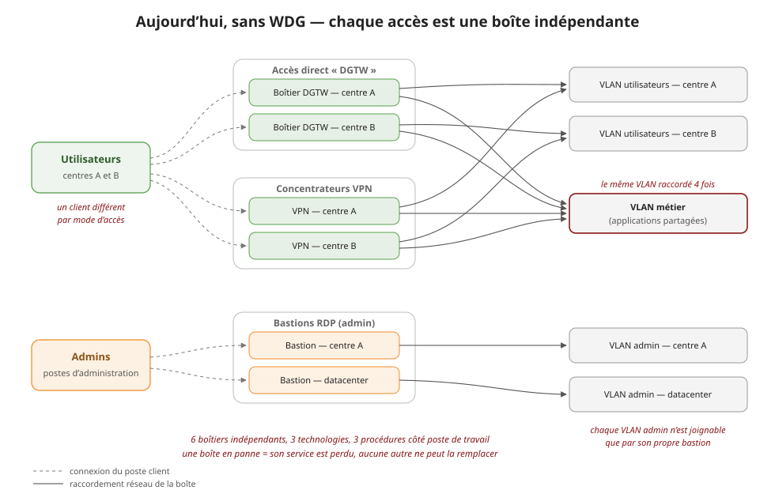
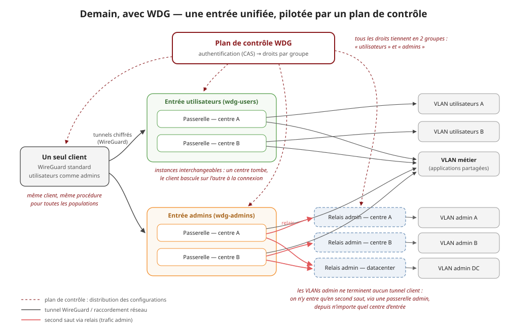

# Sans WDG / avec WDG — comprendre le fonctionnement et l'intérêt

Ce document s'adresse aux équipes réseau et système qui connaissent les VPN
et les bastions classiques, mais pas forcément WireGuard ni WDG. Il compare
la même infrastructure dans deux états : telle qu'elle est exploitée
aujourd'hui, et telle qu'elle devient une fois migrée sur WDG.

Deux niveaux de lecture :

- les **schémas simplifiés** ci-dessous (pas d'adresses ni de ports — juste
  qui se connecte où, et par quoi ça passe) ;
- les **diagrammes détaillés générés depuis la base** du plan de contrôle,
  en [annexe](#annexe--versions-détaillées-générées-depuis-la-base), avec
  endpoints, subnets de tunnel et grants exacts.

## Les deux briques à connaître

**WireGuard** est un protocole VPN moderne, intégré au noyau Linux (et
disponible sur tous les OS clients). Pas de session à négocier, pas de
certificats à déployer : chaque poste a une paire de clés, chaque passerelle
connaît les clés publiques autorisées, et le tunnel est chiffré de bout en
bout. Le client est le même partout — c'est une configuration, pas un
logiciel spécifique.

**WDG** (WireGuard Distributed Gateways) ajoute ce qui manque à WireGuard
pour un parc : un **plan de contrôle**. C'est lui qui authentifie la
personne (via le SSO CAS existant), regarde ses **groupes**, et distribue —
au poste comme aux passerelles — les configurations WireGuard
correspondantes. Les passerelles ne portent aucune logique d'annuaire :
elles appliquent ce que le plan de contrôle leur pousse.

## Cas 1 — aujourd'hui, sans WDG : des silos



Chaque mode d'accès est une boîte indépendante, achetée et exploitée
séparément : boîtiers d'accès direct DGTW, concentrateurs VPN, bastions RDP
pour l'administration. Concrètement :

- **Une boîte = un service.** Si le concentrateur VPN du centre A tombe,
  ses utilisateurs n'ont pas de secours : le VPN du centre B est un autre
  service, avec d'autres comptes. Aucune interchangeabilité.
- **Le câblage se répète.** Le VLAN métier, partagé par tout le monde, est
  raccordé quatre fois — une par boîte qui doit y mener. Chaque nouveau
  besoin d'accès se traduit par du plombage réseau supplémentaire.
- **Les droits vivent dans chaque boîte.** Arrivée, départ, changement
  d'équipe : il faut repasser sur chaque équipement concerné.
- **L'admin est cloisonnée par centre.** Chaque VLAN d'admin n'est
  joignable que par *son* bastion. Pas de vision d'ensemble, et le bastion
  est un point de passage unique sans secours.
- **Côté poste de travail**, trois procédures différentes selon l'accès
  (client DGTW, client VPN, client RDP), donc trois supports à assurer.

## Cas 2 — cible, avec WDG : une entrée unifiée



Tout le monde entre par des tunnels WireGuard ; ce qui change, c'est ce que
le plan de contrôle décide d'ouvrir :

- **Deux services d'entrée** remplacent les six boîtes : `wdg-users` pour
  les utilisateurs, `wdg-admins` pour les admins. Chacun a une passerelle
  par centre, et ces instances sont **interchangeables** : à la connexion,
  si le centre A ne répond pas, le client bascule sur le centre B — c'est
  le failover par centre, sans rien reconfigurer.
- **Un seul client** (WireGuard standard) pour toutes les populations. La
  procédure d'enrôlement est la même pour un utilisateur et pour un admin ;
  seuls les droits diffèrent.
- **Les droits tiennent en deux groupes** (`utilisateurs`, `admins`) gérés
  dans le plan de contrôle, adossé au SSO. Plus de comptes à recopier boîte
  par boîte.
- **Les VLANs d'admin ne terminent aucun tunnel client.** Ils sont derrière
  des passerelles *relay-only* : on n'y entre qu'en **second saut**, depuis
  une passerelle d'entrée admin. Quel que soit le centre par lequel l'admin
  est entré, tous les VLANs d'admin (A, B, datacenter) restent joignables —
  le cloisonnement par centre disparaît sans exposer ces réseaux.

## Ce qu'il faut retenir

| | Sans WDG | Avec WDG |
|---|---|---|
| Points d'entrée | 6 boîtes, 3 technologies | 2 services, 1 technologie |
| Client sur le poste | 3 clients/procédures | 1 client WireGuard standard |
| Panne d'un centre | service perdu pour ses usagers | bascule sur l'autre centre |
| Droits d'accès | configurés boîte par boîte | 2 groupes dans le plan de contrôle |
| VLANs d'admin | joignables via leur seul bastion | second saut via relais, depuis tout centre |
| Nouvel accès à ouvrir | câblage + config d'équipement | un grant de groupe |

Pour le déroulé pas à pas côté poste et passerelles (installation,
enrôlement, contenu de la configuration, rebonds via relais, ajout et
retrait de droits) : [PARCOURS-UTILISATEUR.md](PARCOURS-UTILISATEUR.md).

## Annexe — versions détaillées générées depuis la base

Les deux instantanés détaillés (endpoints, subnets de tunnel, grants) sont
générés depuis la base du plan de contrôle par le générateur standard du
projet :

```sh
make doc-scenarios     # seed sans-wdg → export, seed avec-wdg → export, re-seed demo
```

Les données vivent dans `server/core/management/commands/seed_scenario.py` ;
les diagrammes régénérés atterrissent dans `docs/generated/`, et les versions
committées de référence sont dans [`docs/scenarios/`](scenarios/) :

- [Cas 1 — accès actuels sans WDG](scenarios/scenario-sans-wdg.md)
  ([diagramme](scenarios/scenario-sans-wdg.png))
- [Cas 2 — architecture cible WDG](scenarios/scenario-avec-wdg.md)
  ([diagramme](scenarios/scenario-avec-wdg.png))

> ⚠️ `seed_scenario` **remplace** la topologie en base (et les devices
> enrôlés, par cascade) — stacks de dev/démo uniquement. La cible Makefile
> restaure le seed démo à la fin.

*(Dans le cas 1, les `tunnel 172.31.x.0/24` affichés sont des placeholders :
ces équipements legacy n'ont pas d'overlay WireGuard, mais le champ est
obligatoire dans le modèle.)*

### Architecture d'exposition (rappel des principes cibles)

- **Une seule interface d'admin Django** (le serveur `srv-admin`), joignable
  des seuls postes d'administration : les autres instances du plan de
  contrôle ne routent même pas `/admin/`.
- **Planes de configuration multiples** — la même image sert un ou plusieurs
  planes selon `WDG_PLANES` :

| Plane | Exposition | Usage |
|---|---|---|
| externe | ouverte sur l'extérieur | configuration côté clients (auth CAS + provisioning) |
| interne | interne uniquement | sync des passerelles et relais |
| admin | postes d'administration | l'unique interface d'admin Django |
| amont *(optionnel)* | tiers intermédiaire | instance `external` supplémentaire publiée plus loin en aval |

Détails et exemple de découpage : [DEPLOYMENT.md — Configuration planes](DEPLOYMENT.md#configuration-planes-wdg_planes),
et le déploiement cible complet dans le [DAT](DAT.md).
