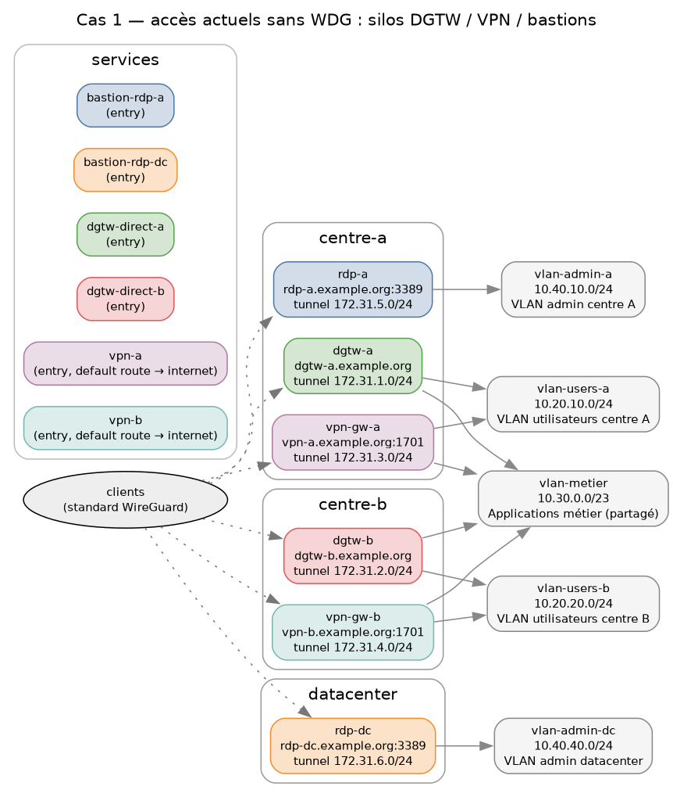
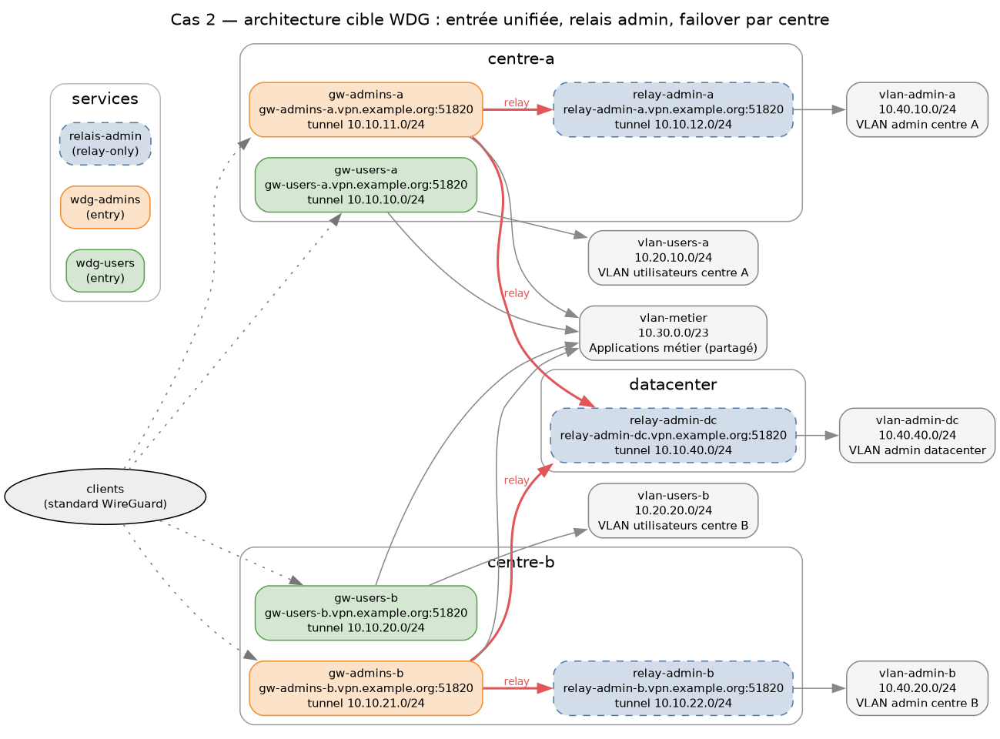

# Scénarios de migration — sans / avec WDG

Deux instantanés de la même infrastructure, générés depuis la base du plan de
contrôle par le générateur standard du projet :

```sh
make doc-scenarios     # seed sans-wdg → export, seed avec-wdg → export, re-seed demo
```

Les données vivent dans `server/core/management/commands/seed_scenario.py` ;
les diagrammes régénérés atterrissent dans `docs/generated/`, et les versions
committées de référence sont dans [`docs/scenarios/`](scenarios/).

> ⚠️ `seed_scenario` **remplace** la topologie en base (et les devices
> enrôlés, par cascade) — stacks de dev/démo uniquement. La cible Makefile
> restaure le seed démo à la fin.

## Cas 1 — aujourd'hui, sans WDG : des silos



Chaque mode d'accès est une boîte indépendante — DGTW en accès direct,
concentrateurs VPN, bastions RDP pour l'admin — avec sa propre population,
sa propre exploitation, et **aucune interchangeabilité** (une boîte = un
service : pas de failover). La complexité se lit sur le schéma :

- les mêmes VLANs sont raccordés plusieurs fois (`vlan-metier` est plombé
  dans quatre équipements, les VLANs utilisateurs dans deux chacun) ;
- les VLANs d'admin ne sont joignables qu'à travers *leur* bastion — silo
  par centre, pas de vision d'ensemble ;
- sept chemins d'accès distincts pour trois populations.

*(Les `tunnel 172.31.x.0/24` affichés sont des placeholders : ces équipements
legacy n'ont pas d'overlay WireGuard, mais le champ est obligatoire dans le
modèle.)*

## Cas 2 — cible, avec WDG : entrée unifiée



- **Deux réservoirs d'entrée** (services) : `wdg-users` et `wdg-admins`, une
  instance par centre. Les instances d'un réservoir sont interchangeables :
  un client bascule sur l'autre centre à la connexion (**failover par
  centre**).
- **Les VLANs d'admin ne terminent aucun client** : ils sont derrière des
  passerelles *relay-only* (`relais-admin`), atteintes uniquement en second
  saut depuis les passerelles admin — quel que soit le centre d'entrée, la
  réachabilité admin est préservée.
- Les droits sont portés par **deux groupes** (`utilisateurs`, `admins`)
  au lieu d'un câblage par équipement.

## Architecture d'exposition (rappel des principes cibles)

- **Une seule interface d'admin Django**, accessible uniquement en interne :
  l'instance externe du plan de contrôle ne route même pas `/admin/`.
- **Planes de configuration multiples** — la même image sert un ou plusieurs
  planes selon `WDG_PLANES` :

| Plane | Exposition | Usage |
|---|---|---|
| externe | ouverte sur l'extérieur | configuration côté clients (auth CAS + provisioning) |
| interne | interne uniquement | admin Django + sync des passerelles |
| amont *(optionnel)* | tiers intermédiaire | instance `external` supplémentaire publiée plus loin en aval |

Détails et exemple de découpage : [DEPLOYMENT.md — Configuration planes](DEPLOYMENT.md#configuration-planes-wdg_planes).
